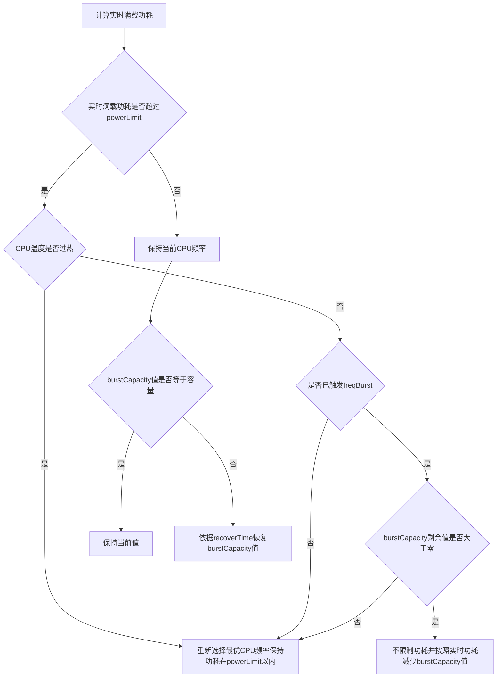

## CuprumTurbo V19 自定义配置开发文档  
此项目使用模块化设计, 每个子JSON对象对应一个`Module`, 通过设置各个模块的`enable`字段可以启用或禁用模块.  
当`enable`字段被设置为`false`后程序将不会继续加载参数, 可以删除该子JSON对象中的其余内容.  
### 配置文件信息  
在这里你可以定义配置文件的名称和作者信息, 请注意不要修改配置文件版本, 此字段将会用于验证调度与该配置是否兼容.  
|字段            |类型   |定义               |
|:---------------|:------|:-----------------|
|name            |string |配置文件的名称     |
|author          |string |配置文件的作者信息  |
|configVersion   |int    |配置文件版本       |
### CpuGovernor - CPU动态调频器  
> 通过计算负载和功耗动态调整CPU频率以尽可能地减少CPU耗电和提升使用中的流畅度  
#### params - 调频器参数  
|字段             |类型   |定义                 |
|:---------------|:------|:--------------------|
|activeRateHz    |int    |活跃时工作频率        |
|idleRateHz      |int    |空闲时工作频率        |
|activeDelay     |int    |活跃状态延迟          |
|minFreqStep     |int    |最小频率差值          |
  
工作频率是CPU调频器的重要参数, 通常Linux内核频率为300HZ,即3.33ms记录一次, 活跃时间/总时间*100即为CPU负载百分比.  
如果工作频率过高将会导致调频器的开销增加且无法获得有效的CPU负载(例如100HZ时只能获得0% 33% 66% 100%四种负载), 过低将导致调频器无法应对瞬时负载.  
最小频率差值为生成CPU频率表的关键参数, 设置得过小将会导致调频速度过慢,过大将会导致调频不够精细.  
#### policies - 策略组    
此项配置类型为`ArrayJson`, 即数组中的每个Json元素对应一个策略组.  
每个策略组中的CPU频率将会同步控制, 应当与内核中每个cluster中包含的CPU对应.  
由于是按照数组的序号来为策略组编号的, 所以策略组的排序应与cluster的排序一致.  
例如SDM845为4+4设计, 即`policy0: CPU0-3; policy1: CPU4-7`.  
|字段            |类型    |定义                                    |
|:--------------|:-------|:---------------------------------------|
|coreNum        |int     |策略组中包含的CPU核心数量                 |
|perfScale      |int     |CPU相对同频算力值                        |
|lowPowerFreq   |int     |CPU功耗最低频率(单位:MHz)                |
|optimalFreq    |int     |CPU最优频率(单位:MHz)                    |
|modelFreq      |int     |用于生成CPU功耗模型的CPU频率(单位:MHz)     |
|modelPower     |int     |处于modelFreq时CPU的满载功耗(单位:mW)     |
  
`CpuGovernor`模块设定中的所有频率都将会被取近似值, 例如CPU频率表中有`1200, 1450, 1700`三个频率, 设定频率为`1500`, 最终取值将为`1450`.  
#### modes - 模式参数  
|字段            |类型     |定义                         |
|:---------------|:-------|:----------------------------|
|powerLimit      |int     |CPU整体功耗限制(单位:mW)       |
|perfMargin      |ArrayInt|CPU性能冗余(范围:0-100)        |
|upRateLatency   |int     |CPU频率提升延迟(单位:ms)       |
|overHeatTemp    |int     |过热温度(单位:°C)              |
|burstCapacity   |int     |频率加速容量(单位:W·ms)        |
|recoverTime     |int     |容量恢复时间(单位:ms)          |
  
CPU整体功耗限制会影响CPU频率上限, 调频器计算的是满载功耗,不会随CPU负载变化而改变.  
`perfMargin`使用`ArrayInt`即整数数组方式存储参数, 数组的序号对应策略组编号.  
CPU频率提升延迟用于降低CPU频率被提升得过高的几率, 每次升频时调频器都会根据频率提升延迟和能耗比变化判定是否需要升频.  
过热温度为触发调频器温度控制的阈值, 当CPU温度超过该值时将限制CPU功耗在`powerLimit`以内并忽略频率加速直到温度降低.  
当触发CPU频率加速时调频器将会忽略`powerLimit`, 如果实时功耗超过`powerLimit`就会消耗`burstCapacity`, 直到容量耗尽时恢复功耗限制.  
当实时功耗低于功耗限制值时将会逐渐恢复`burstCapacity`, `recoverTime`即为容量从耗尽到完全恢复所需的时间.  

功耗限制工作流程如下:  

##### freqBurst - CPU频率加速  
CPU频率加速可以在特定条件触发时调高CPU频率提升积极性, 用于降低部分场景下卡顿的几率.  
|字段            |类型   |定义                         |
|:---------------|:------|:---------------------------|
|durationTime    |int    |频率加速持续时间(单位:ms)     |
|lowLatency      |bool   |是否降低延迟                 |
|extraMargin     |int    |额外性能冗余(范围:0-100)      |
|boost           |int    |频率加速值(范围:0-100)       |
  
触发条件包含`tap` `swipe` `gesture` `heavyload` `jank` `bigJank`,分别在 点击屏幕 滑动屏幕 手势操作 重负载 掉帧 严重掉帧 时触发.  
触发的优先级为`none` < `tap` < `swipe` < `gesture` < `heavyload` < `jank` < `bigJank`, 当更高优先级的加速触发时将覆盖低优先级的加速.  
当要求调频器降低延迟时调频器将会以最快的速度提升CPU频率, 适用于检测到掉帧等需要迅速提升CPU频率的场景.  
`extraMargin`值用于提供额外的性能冗余, 计算公式如下: `acturalMargin = perfMargin + extraMargin`.  
`boost`值用于夸大实际的CPU负载, 计算公式如下: `cpuLoad = cpuLoad + (100 - cpuLoad) * boost / 100`.  
### ThreadSchedOpt - 线程调度优化  
> 通过智能分类线程来实现较为合理的线程调度策略
  
**`此模块未使用标准的规则编写, 暂不建议自行修改此模块的参数.`**

### MtkGpuGovernor - 联发科GPU调频器  
> 这个简易的GPU调频器可以满足对联发科GPU频率的基础调控  
#### voltAdjust - 电压调整  
|字段             |类型    |定义                     |
|:---------------|:-------|:------------------------|
|minVolt         |int     |最低电压(单位:uV)         |
|maxVolt         |int     |最高电压(单位:uV)         |
|voltOffset      |int     |电压偏移值(单位:uV)       |

**`此功能仅用于适配某些默认电压表不可用的设备, 不建议在通用的配置文件中调整此项参数, 可能导致死机甚至烧毁硬件.`**
#### ddrBoosts - 内存频率加速
|字段            |类型    |定义                      |
|:---------------|:-------|:------------------------|
|gpuFreq         |int     |GPU频率(单位:MHz)         |
|ddrMinFreq      |int     |内存频率下限(单位:MHz)     |
  
在当前的GPU频率大于`gpuFreq`时, 设定内存最低频率为`ddrMinFreq`.  
例如`[{"gpuFreq":300,"ddrMinFreq":1866},{"gpuFreq":400,"ddrMinFreq":2133}]`:  
即在GPU频率处于`300-400MHz`时内存的最低频率设置为`1866MHz`, 当GPU频率大于`400MHz`时内存的最低频率设置为`2133MHz`.  
#### modes - 模式参数 
|字段            |类型    |定义                      |
|:---------------|:-------|:------------------------|
|maxFreq         |int     |GPU频率上限(单位:MHz)     |
|minFreq         |int     |GPU频率下限(单位:MHz)     |
|upRateThres     |int     |GPU升频阈值(范围:0-100)   |
|downRateDiff    |int     |GPU降频差值(范围:0-100)   |
  
当GPU负载大于`upRateThres`时提升频率, 当GPU负载减少的差值大于`downRateDiff`时降低频率.  
例如: 设置`upRateThres=90, downRateDiff=10`, 当GPU负载为`75`时降低GPU频率, 当GPU负载为`85`时GPU频率不变,当GPU负载为`95`时提升GPU频率.  
`upRateThres`的值越小升频越积极, `downRateDiff`的值越大降频越缓慢, `downRateDiff`的值不得大于`upRateThres`.  
### FileWriter - 文件写入器
> 此模块用于在触发某些场景时自动写入文件  
#### scenes - 场景触发器
当触发指定场景时将会自动向文件中写入预设的文本, 写入方式与`echo [text] > [path]`相同且效率更高, 写入单个文件的耗时通常不超过1ms.  
支持的场景如下:  
`init`: 调度初始化时触发, 仅执行一次.  
`screenOn`: 屏幕点亮时触发.  
`screenOff`: 屏幕熄灭时触发.  
`powersaveMode`: 切换到powersave模式时触发.  
`balanceMode`: 切换到balance模式时触发.  
`performanceMode`: 切换到performance模式时触发.  
`fastMode`: 切换到fast模式时触发.  
此项配置类型为`ArrayJson`, 即数组中的每个Json元素对应一个文件写入任务.  
|字段            |类型    |定义                      |
|:---------------|:-------|:------------------------|
|path            |string  |写入的目标地址            |
|text            |string  |需要写入的文本            | 
  
